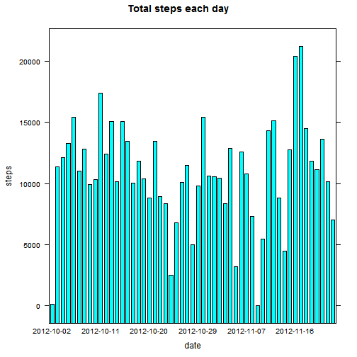
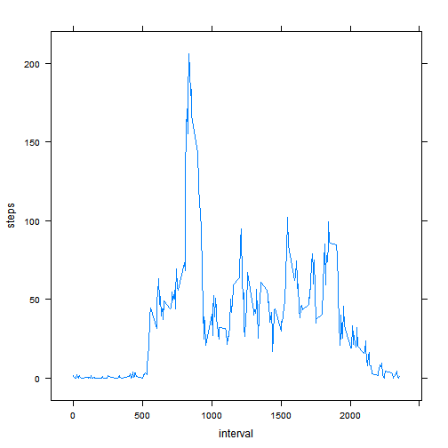

Reproducible Reserach: Peer Assessment 1
==============================================

```r
opts_chunk$set(echo = TRUE)
library(lattice)
library(knitr)
```
## Loading and preprocessing the data

```r
rawdata<-read.csv("activity.csv", header = TRUE)
```
## What is mean total number of steps taken per day?

1.Histogram of the total number of steps taken each day


```r
data<-rawdata[!is.na(rawdata$steps), ]  
stepAgg<-aggregate(steps~date, data, sum)
xLabels<-seq(1, nrow(stepAgg), by = 12)
scalesList<-list(x = list(labels = stepAgg$date, at = xLabels))
barchart(steps~date, stepAgg, scales=scalesList, main="Total steps each day", xlab = "date")
```

 

2.Calcuate and report the mean and median total number of steps taken per day

```r
mean(stepAgg$steps)
```

```
## [1] 10766.19
```

```r
median(stepAgg$steps)
```

```
## [1] 10765
```

What is the average daily activity patter?
1. Make a time series plot(i.e. type='l) of the 5-minute interval(x-axis) and the average number of steps taken, averaged across all days(y-axis)

```r
intervalAgg<-aggregate(steps~interval, data, mean)
xyplot(steps~interval, intervalAgg, type="l")
```

 

### 2.Which 5-mintue interval, on average across all days in the dataset, contains the maximum number of steps?

```r
row<-which.max(intervalAgg$steps)
intervalAgg[row,]$interval
```

```
## [1] 835
```

## Inputing missing values
1.Calcuate and report total number of missing values in dataset

```r
sum(is.na(rawdata$steps))
```

```
## [1] 2304
```

2.Device a strategy for filling in all of the missing values in the dataset.

Use the mean for that interval across days to fill the missing value in the dataset.

3.create a new dataset that is equal to the origianl dataset but with the missing data filled in


```r
meanAgg<-aggregate(steps~interval, data, mean)
numDates<-length(unique(rawdata$date))
newAgg<-meanAgg[rep(seq_len(nrow(meanAgg)), numDates),]
misRows<-is.na(rawdata$steps)
rawdata[misRows,]$steps<-newAgg[misRows, ]$steps
filledData<-rawdata
```

4.Make a histogram of the total number of steps taken each day

```r
stepAgg<-aggregate(steps~date, filledData, sum)
xLabels<-seq(1, nrow(stepAgg), by = 12)
scalesList<-list(x = list(labels = stepAgg$date, at = xLabels))
barchart(steps~date, stepAgg, scales=scalesList, main="total steps each day", xlab="date")
```

 

Calculate and report the **mean** and **median** total number of steps taken per day

```r
mean(stepAgg$steps)
```

```
## [1] 10766.19
```

```r
median(stepAgg$steps)
```

```
## [1] 10766.19
```

**Do these values differ from the estimates from the first part of the assignment?**

The mean value is different, median is the same.

**What is the impact of the inputing missing data on the estimates of the total daily number of steps?**

If there is no missing steps for that day, the total steps would be same. If there are steps missing for a day, the total daily number of steps would be set to the average total steps
across days.


## Are there differience in actitivy patterns between weekdays and weekend?

1.create a new factor variable in dataset with two levels--"weekday" and "weekend" indicating whether a given day is a weekday or weekend day.

```r
days<-(weekdays(as.Date(filledData$date)) %in% c('Saturday','Sunday'))
wday<-c("weekday", "weekend")
f<-factor(days, labels = wday)
```

2.Make a panel plot containing a time series plot of the 5-minute interval (x-axis) and the average number of steps taken, averaged across all weekday days or weekend days (y-axis).

```r
tdata<-transform(filledData, day = f)
aggData<-aggregate(tdata$steps, by=list(tdata$interval, tdata$day), mean)
names(aggData)<-c("interval", "day", "steps")
xyplot(steps~interval | day, aggData, type="l", layout=c(1, 2), xlab="Interval", ylab="Number of steps")
```

 
